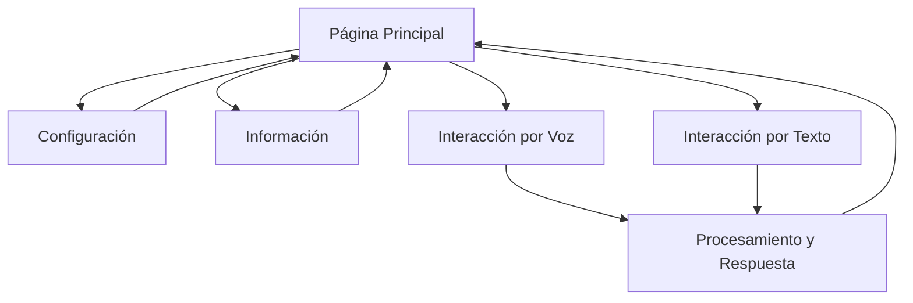

# Documento de Requerimientos del Producto - Asistente Virtual CECADE

## 1. Visión General del Producto

Asistente virtual interactivo en formato de aplicación web optimizado para tablets, diseñado específicamente para el colegio CECADE. El sistema incorpora capacidades avanzadas de reconocimiento de voz (speech-to-text), síntesis de voz (text-to-speech) y **inteligencia artificial de Google Gemini** para facilitar una interacción natural y fluida con los usuarios durante las exhibiciones OpenHouse de la especialidad de programación.

El asistente tiene como objetivo principal proporcionar respuestas precisas, contextualmente relevantes y naturalmente coherentes sobre programación, utilizando la IA de Gemini para procesar consultas complejas, generar respuestas inteligentes y mantener conversaciones fluidas que demuestren las capacidades tecnológicas avanzadas del colegio.

## 2. Características Principales

### 2.1 Roles de Usuario

| Rol | Método de Acceso | Permisos Principales |
|-----|------------------|----------------------|
| Visitante | Acceso directo sin registro | Puede interactuar con el asistente, hacer preguntas sobre programación, escuchar respuestas |
| Administrador | Acceso mediante configuración local | Puede modificar respuestas, actualizar contenido, configurar parámetros del asistente |

### 2.2 Módulos de Funcionalidad

Nuestra aplicación de asistente virtual consta de las siguientes páginas principales:

1. **Página Principal**: interfaz de chat con avatar animado, controles de voz, área de respuestas.
2. **Página de Configuración**: ajustes de voz, volumen, velocidad de respuesta, temas visuales.
3. **Página de Información**: datos sobre CECADE, especialidad de programación, créditos del proyecto.

### 2.3 Detalles de Páginas

| Nombre de Página | Nombre del Módulo | Descripción de Funcionalidad |
|------------------|-------------------|-------------------------------|
| Página Principal | Avatar Interactivo | Mostrar avatar animado que responde visualmente a las interacciones, cambios de expresión según el contexto |
| Página Principal | Control de Voz | Activar/desactivar micrófono, indicador visual de grabación, procesamiento de speech-to-text |
| Página Principal | Área de Chat | Mostrar conversación en tiempo real, historial de preguntas y respuestas, formato de burbujas de chat |
| Página Principal | Síntesis de Voz | Reproducir respuestas con text-to-speech, controles de pausa/reproducción, ajuste de velocidad |
| Página Principal | Sistema de Respuestas IA | Procesar preguntas complejas con Gemini AI, generar respuestas contextuales inteligentes, análisis de sentimientos, comprensión de intención del usuario |
| Página Configuración | Ajustes de Audio | Configurar volumen, velocidad de voz, selección de voz (masculina/femenina) |
| Página Configuración | Temas Visuales | Cambiar colores, fondos, estilo del avatar, modo oscuro/claro |
| Página Configuración | Configuración Avanzada | Ajustar sensibilidad del micrófono, tiempo de espera, idioma de respuestas |
| Página Información | Datos del Colegio | Mostrar información sobre CECADE, historia, especialidades disponibles |
| Página Información | Especialidad Programación | Detallar currículo, proyectos destacados, tecnologías enseñadas |
| Página Información | Créditos | Información del equipo desarrollador, tecnologías utilizadas, agradecimientos |

### 2.4 Capacidades de Inteligencia Artificial (Gemini)

| Funcionalidad | Descripción | Beneficios |
|---------------|-------------|------------|
| Procesamiento de Lenguaje Natural | Comprensión avanzada de consultas complejas y contexto conversacional | Respuestas más precisas y naturales |
| Generación de Respuestas Inteligentes | Creación de respuestas personalizadas basadas en el contexto y perfil del usuario | Experiencia más personalizada y relevante |
| Análisis de Sentimientos | Detección del tono emocional en las preguntas del usuario | Respuestas empáticas y apropiadas al estado de ánimo |
| Comprensión Contextual | Mantenimiento del contexto a lo largo de la conversación | Conversaciones más fluidas y coherentes |
| Adaptación de Respuestas | Ajuste del nivel técnico según el perfil detectado del usuario | Explicaciones apropiadas para diferentes audiencias |
| Detección de Intenciones | Identificación precisa de lo que el usuario realmente quiere saber | Respuestas más directas y útiles |

## 3. Proceso Principal

**Flujo de Interacción del Usuario:**

1. El usuario accede a la página principal del asistente
2. Ve el avatar animado y la interfaz de chat
3. Puede hacer clic en el botón de micrófono o escribir directamente
4. Si usa voz: el sistema convierte speech-to-text y muestra la pregunta
5. **Gemini AI analiza la consulta**: comprende el contexto, detecta intenciones y sentimientos
6. **Gemini genera respuesta inteligente**: crea una respuesta personalizada y contextualmente relevante
7. La respuesta se muestra en texto y se reproduce con text-to-speech
8. El avatar reacciona visualmente según el tipo de respuesta y emoción detectada
9. El sistema mantiene el contexto conversacional para futuras interacciones
10. El usuario puede continuar la conversación o explorar configuraciones

**Flujo de Administración:**

1. El administrador accede a la configuración avanzada
2. Puede actualizar las respuestas predefinidas en archivos JSON
3. Modifica parámetros de comportamiento del asistente
4. Guarda los cambios que se reflejan inmediatamente

## 4. Diseño de Interfaz de Usuario

### 4.1 Estilo de Diseño

- **Colores primarios**: Azul CECADE (#1E3A8A), Blanco (#FFFFFF), Gris claro (#F3F4F6)
- **Colores secundarios**: Verde éxito (#10B981), Naranja acento (#F59E0B), Rojo alerta (#EF4444)
- **Estilo de botones**: Redondeados con sombras suaves, efectos hover animados
- **Tipografía**: Inter para textos principales (16-18px), Poppins para títulos (24-32px)
- **Estilo de layout**: Diseño centrado en tarjetas, navegación superior fija, espaciado generoso
- **Iconos y emojis**: Iconos de Lucide React, emojis contextuales para respuestas lúdicas

### 4.2 Resumen de Diseño de Páginas

| Nombre de Página | Nombre del Módulo | Elementos de UI |
|------------------|-------------------|------------------|
| Página Principal | Avatar Interactivo | Avatar 3D animado centrado, expresiones dinámicas, colores vibrantes, animaciones suaves |
| Página Principal | Control de Voz | Botón circular grande con ícono de micrófono, indicador de onda sonora, colores que cambian según estado |
| Página Principal | Área de Chat | Burbujas de chat diferenciadas por color, scroll suave, timestamps, indicadores de carga |
| Página Configuración | Panel de Ajustes | Sliders para volumen y velocidad, toggles para opciones, preview en tiempo real |
| Página Información | Tarjetas Informativas | Layout de tarjetas con imágenes, texto estructurado, enlaces destacados |

### 4.3 Responsividad

La aplicación está optimizada principalmente para tablets (768px-1024px) con adaptación para dispositivos móviles y desktop. Se incluye optimización para interacciones táctiles con botones de tamaño adecuado y gestos intuitivos.