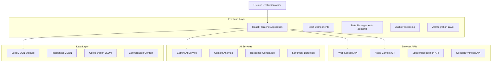
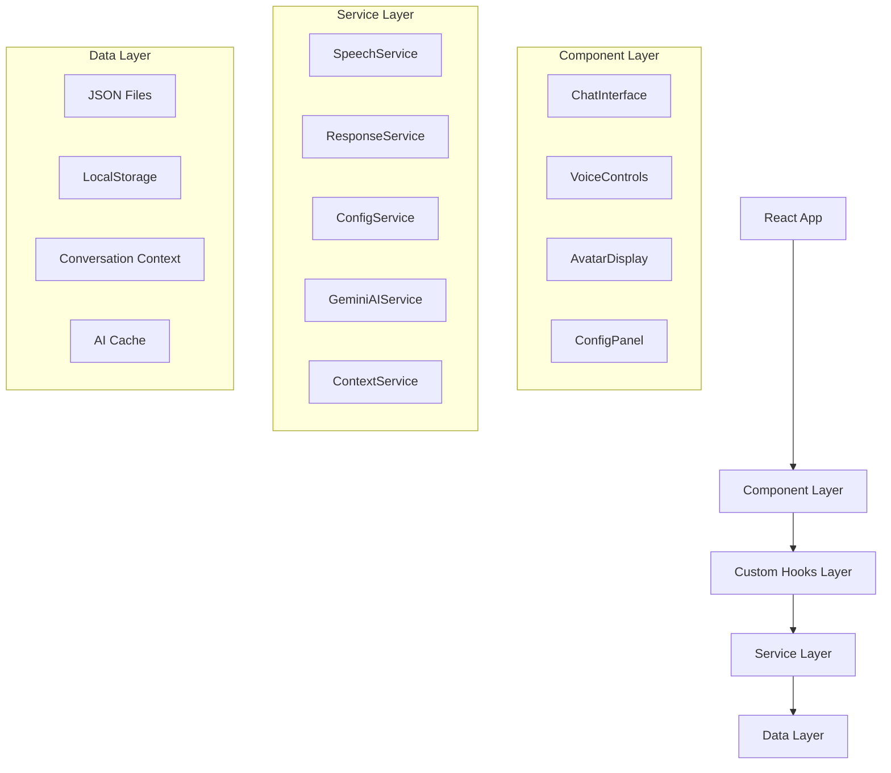

# Documento de Arquitectura Técnica - Asistente Virtual CECADE

## 1. Diseño de Arquitectura



## 7. Integración de Gemini AI

### 7.1 Configuración del Servicio

**GeminiAIService**

```typescript
class GeminiAIService {
  private config: GeminiConfig;
  private contextService: ContextService;
  
  async analyzeQuery(query: string, context: ConversationContext): Promise<AIAnalysis> {
    // Análisis de intención y sentimiento
    // Detección del nivel técnico del usuario
    // Comprensión del contexto conversacional
  }
  
  async generateResponse(analysis: AIAnalysis, query: string): Promise<string> {
    // Generación de respuesta personalizada
    // Adaptación al nivel del usuario
    // Mantenimiento de coherencia contextual
  }
  
  async updateContext(message: ChatMessage, analysis: AIAnalysis): Promise<void> {
    // Actualización del contexto conversacional
    // Aprendizaje de preferencias del usuario
  }
}
```

### 7.2 Flujo de Procesamiento con IA

```mermaid
sequenceDiagram
    participant U as Usuario
    participant C as ChatInterface
    participant AI as GeminiAIService
    participant CS as ContextService
    participant R as ResponseService
    
    U->>C: Envía consulta
    C->>CS: Obtiene contexto actual
    CS-->>C: Contexto de conversación
    C->>AI: Analiza consulta + contexto
    AI-->>C: Análisis (intención, sentimiento, nivel)
    C->>AI: Genera respuesta inteligente
    AI-->>C: Respuesta personalizada
    C->>CS: Actualiza contexto
    C->>R: Reproduce respuesta
    R-->>U: Respuesta con audio
```



### 7.3 Características Avanzadas

- **Aprendizaje Contextual**: El sistema mantiene memoria de conversaciones previas para mejorar respuestas futuras
- **Adaptación de Nivel**: Detecta automáticamente si el usuario es principiante, intermedio o avanzado en programación
- **Análisis Emocional**: Ajusta el tono de las respuestas según el estado emocional detectado
- **Generación Dinámica**: Crea respuestas únicas en lugar de usar solo respuestas predefinidas
- **Optimización de Contexto**: Mantiene solo la información relevante para evitar sobrecarga de tokens

## 2. Descripción de Tecnologías

* **Frontend**: React\@18 + TypeScript + Vite + TailwindCSS\@3

* **Estado**: Zustand para manejo de estado global

* **Audio**: Web Speech API (SpeechRecognition + SpeechSynthesis)

* **Inteligencia Artificial**: Google Gemini AI para procesamiento de lenguaje natural y generación de respuestas

* **Animaciones**: Framer Motion para animaciones del avatar

* **Iconos**: Lucide React

* **Almacenamiento**: Local JSON files + LocalStorage para configuraciones + Context Storage para IA

* **Backend**: Ninguno (aplicación completamente frontend con integración de servicios AI)

## 3. Definiciones de Rutas

| Ruta    | Propósito                                                            |
| ------- | -------------------------------------------------------------------- |
| /       | Página principal con interfaz de chat y avatar interactivo           |
| /config | Página de configuración de audio, temas y parámetros del asistente   |
| /info   | Página de información sobre CECADE y la especialidad de programación |

## 4. Definiciones de API

### 4.1 APIs del Navegador

**Reconocimiento de Voz**

```typescript
// Web Speech API - SpeechRecognition
interface SpeechRecognitionConfig {
  continuous: boolean;
  interimResults: boolean;
  lang: string;
  maxAlternatives: number;
}
```

**Síntesis de Voz**

```typescript
// Web Speech API - SpeechSynthesis
interface SpeechSynthesisConfig {
  text: string;
  voice: SpeechSynthesisVoice;
  volume: number;
  rate: number;
  pitch: number;
}
```

### 4.2 Interfaces de Datos

**Mensaje de Chat**

```typescript
interface ChatMessage {
  id: string;
  type: 'user' | 'assistant';
  content: string;
  timestamp: Date;
  audioUrl?: string;
}
```

**Configuración del Asistente**

```typescript
interface AssistantConfig {
  voice: {
    rate: number; // 0.5 - 2.0
    pitch: number; // 0 - 2
    volume: number; // 0 - 1
    voiceIndex: number;
  };
  theme: {
    mode: 'light' | 'dark';
    primaryColor: string;
    avatarStyle: string;
  };
  behavior: {
    autoSpeak: boolean;
    micSensitivity: number;
    responseDelay: number;
  };
}
```

**Respuesta del Asistente**

```typescript
interface AssistantResponse {
  id: string;
  keywords: string[];
  response: string;
  category: 'programming' | 'greeting' | 'joke' | 'general';
  emotion: 'happy' | 'neutral' | 'excited' | 'thinking';
  aiGenerated?: boolean;
  confidence?: number;
}
```

**Configuración de Gemini AI**

```typescript
interface GeminiConfig {
  apiKey: string;
  model: string;
  temperature: number;
  maxTokens: number;
  contextWindow: number;
}
```

**Contexto de Conversación**

```typescript
interface ConversationContext {
  sessionId: string;
  messages: ChatMessage[];
  userProfile: {
    detectedLevel: 'beginner' | 'intermediate' | 'advanced';
    interests: string[];
    sentiment: 'positive' | 'neutral' | 'negative';
  };
  lastInteraction: Date;
}
```

**Análisis de IA**

```typescript
interface AIAnalysis {
  intent: string;
  sentiment: 'positive' | 'neutral' | 'negative';
  confidence: number;
  suggestedResponse: string;
  context: string[];
  userLevel: 'beginner' | 'intermediate' | 'advanced';
}
```

## 5. Arquitectura del Servidor



## 6. Modelo de Datos

### 6.1 Definición del Modelo de Datos


### 6.2 Definición de Datos (JSON)

**Archivo de Respuestas (responses.json)**

```json
{
  "programming": [
    {
      "id": "prog_001",
      "keywords": ["qué es programación", "programming", "código"],
      "response": "La programación es el arte de crear instrucciones para que las computadoras resuelvan problemas. En CECADE enseñamos lenguajes como Python, JavaScript y Java.",
      "category": "programming",
      "emotion": "excited"
    }
  ],
  "greetings": [
    {
      "id": "greet_001",
      "keywords": ["hola", "buenos días", "saludos"],
      "response": "¡Hola! Soy el asistente virtual de CECADE. Estoy aquí para contarte todo sobre nuestra especialidad en programación. ¿Qué te gustaría saber?",
      "category": "greeting",
      "emotion": "happy"
    }
  ],
  "jokes": [
    {
      "id": "joke_001",
      "keywords": ["chiste", "broma", "humor"],
      "response": "¿Por qué los programadores prefieren el modo oscuro? Porque la luz atrae bugs! 🐛😄",
      "category": "joke",
      "emotion": "happy"
    }
  ]
}
```

**Archivo de Configuración (config.json)**

```json
{
  "defaultConfig": {
    "voice": {
      "rate": 1.0,
      "pitch": 1.0,
      "volume": 0.8,
      "voiceIndex": 0
    },
    "theme": {
      "mode": "light",
      "primaryColor": "#1E3A8A",
      "avatarStyle": "friendly"
    },
    "behavior": {
      "autoSpeak": true,
      "micSensitivity": 0.7,
      "responseDelay": 500
    }
  },
  "schoolInfo": {
    "name": "CECADE",
    "specialty": "Programación",
    "description": "Centro educativo especializado en tecnología y programación",
    "technologies": ["Python", "JavaScript", "Java", "React", "Node.js"]
  }
}
```

**Estructura de Archivos del Proyecto**

```
src/
├── components/
│   ├── Avatar/
│   ├── Chat/
│   ├── VoiceControls/
│   └── Config/
├── hooks/
│   ├── useSpeechRecognition.ts
│   ├── useSpeechSynthesis.ts
│   ├── useAssistant.ts
│   ├── useGeminiAI.ts
│   └── useConversationContext.ts
├── services/
│   ├── speechService.ts
│   ├── responseService.ts
│   ├── configService.ts
│   ├── geminiAIService.ts
│   ├── contextService.ts
│   └── sentimentAnalysisService.ts
├── data/
│   ├── responses.json
│   ├── config.json
│   └── aiPrompts.json
├── types/
│   ├── index.ts
│   ├── aiTypes.ts
│   └── contextTypes.ts
└── utils/
    ├── audioUtils.ts
    ├── textUtils.ts
    ├── aiUtils.ts
    └── contextUtils.ts
```

